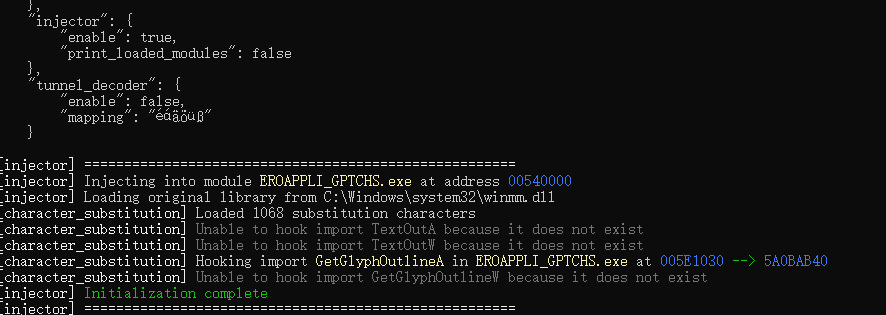

<div align=center></div>

<h1><p align='center' >GalTransl</p></h1>
<div align=center>      </div>
<p align='center' >支持GPT-4/Claude/Deepseek/Sakura等大语言模型的Galgame自动化翻译解决方案</p>

  [English](https://github.com/XD2333/GalTransl/blob/main/README_EN.md)
  
  GalTransl是一套将数个基础功能上的微小创新与对GPT提示工程（Prompt Engineering）的深度利用相结合的Galgame自动化翻译工具，用于制作内嵌式翻译补丁。   
   
## 前言
&ensp;&ensp;&ensp;&ensp;GalTransl的核心是一组自动化翻译脚本，解决了使用ChatGPT自动化翻译Gal过程中已知的大部分问题，并提高了整体的翻译质量。同时，通过与其他项目的组合，打通了制作补丁的完整流程，一定程度降低了上手门槛。对此感兴趣的朋友可以通过本项目更容易的构建具有一定质量的机翻补丁，并(或许)可以尝试在此框架的基础上高效的构建更高质量的汉化补丁。  

  * 特性：   
  1. 支持**GPT3.5、Newbing、GPT-4、Sakura**等大语言模型，并通过提示工程提高了GPT的翻译质量   
  2. 首创**GPT字典**，让GPT了解人设，准确翻译人名、人称代词与生词   
  3. 通过译前、译后字典与条件字典实现灵活的自动化字典系统   
  4. 实时保存缓存、自动断点续翻   
  5. 结合其他项目支持多引擎脚本一键解包与注入，提供完整教程降低上手难度
  6. （新）现在也支持直接翻译srt、lrc、vtt字幕文件，mtool json文件，t++ excel文件，epub文件
  7. （新）🤗 [Galtransl-7B-v2](https://huggingface.co/SakuraLLM/GalTransl-7B-v2)是为视觉小说翻译任务专项优化的本地模型，可在6G VRAM以上显卡部署，由sakuraumi和xd2333共同构建。

<b>❗❗使用本工具翻译并在未做全文校对/润色的前提下发布时，请在最显眼的位置标注"GPT翻译/AI翻译补丁"，而不是"个人汉化"或"AI汉化"补丁。</b>

## 近期更新
* 2024.5：更新v5，新增GalTransl-7B模型，新增多种文件类型支持   
* 2024.2：更新v4版，主要支持了插件系统  
* 2023.12：更新v3版，支持基于文件的多线程 by @ryank231231
* 2023.7：更新v2版，主要重构了代码 by @ryank231231
* 2023.6：v1初版发布

## 导航
* [环境准备](https://github.com/XD2333/GalTransl#环境准备)：环境与软件的安装   
* [上手教程](https://github.com/XD2333/GalTransl#上手教程)：全流程介绍如何制作一个机翻补丁，只想看怎么使用本工具的话，可以只看第2章   
* [配置文件与翻译引擎设置](https://github.com/XD2333/GalTransl#配置文件与翻译引擎设置)：本篇详细介绍各个翻译引擎API的调用与配置方式。   
* [GalTransl核心功能介绍](https://github.com/XD2333/GalTransl#galtransl核心功能介绍)：介绍GPT字典、缓存、普通字典、找问题等功能。
* 后续教程已经[转移至Wiki](https://github.com/xd2333/GalTransl/wiki)

## 环境准备
  * **免环境版**   
  现在release里有winexe版本，不需要安装运行环境和依赖。
   
  * [下载本项目](https://github.com/XD2333/GalTransl/releases/)   
  解压到任意位置，例如 `D:\GalTransl`

  * Python   
  安装 Python 3.11/3.12。 [下载](https://www.python.org/downloads/release/python-3117/)   
  **安装时勾选下方 add Python to path**   

  * 安装Python依赖   
  安装 Python 后
  
  如果你是**初学者**，可以直接双击`安装、更新依赖.bat`来安装本项目需要的依赖。

  如果你**熟悉python**，本项目提供Poetry进行依赖管理，可以通过以下命令安装并运行程序：

  ```
  cmd
  pip config set global.index-url https://pypi.tuna.tsinghua.edu.cn/simple
  pip install poetry
  poetry install
  cd 到本仓库目录
  poetry shell
  python -m GalTransl -p 你的项目路径 -t 翻译后端
  ```

## 实用工具
| 名称 | 说明 |
| --- | --- |
| GARbro | 引擎工具：神一样的解包工具。[下载](https://github.com/morkt/GARbro/releases/download/v1.5.44/GARbro-v1.5.44.2904.rar) |
| [KirikiriTools](https://github.com/arcusmaximus/KirikiriTools) | 引擎工具：Krkr、krkrz 提取、注入工具 |
| [UniversalInjectorFramework](https://github.com/AtomCrafty/UniversalInjectorFramework) | 引擎工具：sjis隧道、sjis替换模式通用注入框架 |
| [VNTextProxy](https://github.com/arcusmaximus/VNTranslationTools) | 引擎工具：sjis隧道模式通用注入框架 |
| GalTransl_DumpInjector | 脚本工具：[VNTextPatch](https://github.com/arcusmaximus/VNTranslationTools)的图形化界面，综合脚本文本提取导入工具 |
| [SExtractor](https://github.com/satan53x/SExtractor) | 脚本工具：综合脚本文本提取导入工具 |
| [DBTXT2Json_jp](https://github.com/XD2333/DBTXT2Json_jp) | 脚本工具：通用双行文本与json_jp互转脚本 |
| EmEditor | 文本工具：神一样的文本编辑器。[下载](https://www.ghxi.com/emeditor.html)  |
| [KeywordGacha](https://github.com/neavo/KeywordGacha) | 文本工具：使用 OpenAI 兼容接口自动生词语表 |

## 上手教程
做一个gal内嵌翻译补丁的大致流程是：   
1. 识别引擎 -> 解包资源包拿到脚本 -> 接2.   
2. 解包脚本为日文文本 -> 翻译为中文文本 -> 构建中文脚本 -> 接3.   
3. 封包为资源包/免封包 -> 接4.
4. 引擎支持unicode的话，直接玩 -> 引擎是shift jis的，尝试2种路线使其支持显示中文   

我会分成以上4个模块分步讲解，这个段落为了让没做过的朋友也能有机会上手，会写的更照顾小白一些。   

* 建议先只跑开头一个文件的翻译，或先随便添加一些中文，导回游戏确认可以正常显示再全部翻译   
   
（点击展开详细说明）   
<details>

<summary>

### 第一章 识别与解包   

</summary>
识别引擎其实很简单，通常来说，使用GARbro打开游戏目录内的任意资源包，在左下方的状态栏中就会显示引擎名称： 

或者，参考[资源包后缀表](https://morkt.github.io/GARbro/supported.html)，比较资源包的后缀。   

剧情脚本一般在一些有明显关键字的资源包，或在资源包中明显关键字的目录内，例如：scene、scenario、message、script等字样。并且脚本通常是由许多明显分章节、分人物，有的还分出了剧情和hs(例如带_h)，通常多翻找几个资源包就能找到。   

或者，参考[Dir-A佬的教程](https://space.bilibili.com/8144708/)   

特别的，针对新的krkrz引擎，GARbro已经无法打开资源包，可以用[KrkrzExtract项目](https://github.com/xmoezzz/KrkrzExtract/releases/tag/1.0.0.0)，将游戏拖到exe上启动。然后下一个全cg存档，直接把所有剧情ctrl一遍，也可以获取到脚本文件。   

</details>
<details>

<summary>

### 第二章 提取与翻译   

</summary>

* **【2.1. 提取脚本文本】**   
&ensp;&ensp;&ensp;&ensp;通常情况下，本项目是结合[VNTextPatch工具](https://github.com/arcusmaximus/VNTranslationTools)来解包脚本的。 VNTextPatch是由外国大佬arcusmaximus开发的[支持许多引擎](https://github.com/arcusmaximus/VNTranslationTools#vntextpatch)脚本的提取与注入的通用工具。（但并不是这些引擎都能搞定了，实测有的游戏是会提取失败的）   
   
&ensp;&ensp;&ensp;&ensp;VNTextPatch是使用cmd操作的，为了降低上手难度，我搓了一个图形化的界面，你可以在项目的useful_tools/GalTransl_DumpInjector内找到，点击GalTransl_DumpInjector.exe运行。   
&ensp;&ensp;&ensp;&ensp;现在，你只需要选择日文脚本目录，然后选择保存提取的日文json的目录，这里一般将日文脚本放到叫script_jp的文件夹，再新建一个gt_input目录，用于存储提取出的脚本：   

&ensp;&ensp;&ensp;&ensp;需要注意GalTransl全程是使用name-message格式的JSON输入、处理和输出的。[JSON是什么](http://c.biancheng.net/json/what-is-json.html)   
提取出来的json文件可以用emeditor打开，一般是这个样子的：   
```json
[
  {
    "name": "咲來",
    "message": "「ってか、白鷺学園だったらあたしと一緒じゃん。\r\nセンパイだったんですねー」"
  }
]
```
&ensp;&ensp;&ensp;&ensp;其中，每个{object(对象)}是一句话，`message`是消息内容，如果object还带了`name`，说明是对话。不过可能并不是所有类型的脚本都可以带name提取，**当可以正确提取name时，GalTransl的翻译质量会更好**。   
&ensp;&ensp;&ensp;&ensp;PS. GalTransl只支持指定格式的json文件输入，但并不是说GalTransl就与VNTextPatch工具绑定了，也可以使用SExtractor工具，现在也支持导出GalTransl需要的name-message格式JSON   

* **【2.2. GalTransl启动】**   
&ensp;&ensp;&ensp;&ensp;将本项目下载下来解压到任意位置（示例中默认为D盘根目录），在项目示例文件夹`sampleProject`中，找到示例配置文件`config.inc.yaml`，将其重命名为`config.yaml`。另外，也将sampleProject文件夹改个名字，一般是游戏的名字。   

&ensp;&ensp;&ensp;&ensp;本教程使用GPT3.5官方API来举例。其他引擎可参考下面[引擎使用](https://github.com/XD2333/GalTransl?tab=readme-ov-file#配置文件与翻译引擎设置)章节，对应修改示例项目的`config.yaml`即可调用。   
&ensp;&ensp;&ensp;&ensp;先将所有提取出的日文json文件放入示例文件夹内的`gt_input`文件夹中，然后用任意文本编辑器编辑`config.yaml`文件，按**注释**修改以下内容：
```yaml
# 代理设置
proxy:
  enableProxy: true # 是否启用代理(true/false)
  proxies:
    - address: socks5://127.0.0.1:10818 # 代理地址，也可以改成http://……
backendSpecific:
  GPT35: # GPT3.5 官方 API
    tokens: # 令牌列表
      - token: sk-xxxxxxxx # 你的令牌
        endpoint: https://api.openai.com  # 这个令牌对应的OPENAI API请求的端点，使用转发或第三方API时需要修改
      - token: sk-yyyyyyyy # 可以填多个令牌，如果你只有一个的话，把示例文件的这两行删掉
        endpoint: "" # 可以填多个令牌，如果你只有一个的话，把示例文件的这两行删掉
    defaultEndpoint: https://api.openai.com # 默认 API 端点，一般不修改
    rewriteModelName: "" # 你可以修改这个参数来自定义想要使用的模型，如果不自定义的话，会使用默认的模型
```   
&ensp;&ensp;&ensp;&ensp;在这里需要一个openai的api key，以及需要魔法上网来走代理访问openai官方api端点。   
&ensp;&ensp;&ensp;&ensp;如果没有api key或魔法上网的话，你还可以使用一些第三方api中转项目，例如：   
* [GPT-API-free](https://github.com/chatanywhere/GPT_API_free)，免费API中转，提供有请求频率限制的用于测试。   
* 一些收费api转发项目，例如：[硅基流动](https://cloud.siliconflow.cn/i/SvDatvsk)（建议设置rewriteModelName: "deepseek-ai/DeepSeek-V2.5"）、[oaipro](https://api.oaipro.com/register?aff=ceAU)等等，以上只是举例，更多中转可以谷歌，本项目不担保它们的稳定性及可用性。   
   
&ensp;&ensp;&ensp;&ensp;但要注意这里获取的key是第三方的key，不能用于官方API端点。如果你使用类似项目的话，做以下额外的修改：   
```python
  enableProxy: false # 此时不用设置代理

  GPT35: 
    tokens: 
      - token: sk-xxxxxxxx # 你的第三方令牌
        endpoint: https://xxxx  # 使用对应的第三方API端点，一般在中转站里都会写
```   
   
&ensp;&ensp;&ensp;&ensp;修改好项目设置后，确保你已经安装了需要的依赖（见环境准备），然后双击`run.bat`（免环境版双击exe），首先拖入项目文件夹，例如`D:\GalTransl-main\sampleProject`   

接着选择gpt35:


程序就会启动并开始翻译： 


&ensp;&ensp;&ensp;&ensp;**但是，不建议就这样开始翻译了**，请至少要先学会[GPT字典的使用](https://github.com/XD2333/GalTransl#gpt字典)，为你要翻译的gal设定好各角色的人名字典，这样才能保证基本的翻译质量。   

&ensp;&ensp;&ensp;&ensp;翻译完成后，如果想手工修正，可以对缓存进行修正，并重新生成结果json，见[翻译缓存章节](https://github.com/XD2333/GalTransl#翻译缓存)

* **【2.3. 构建中文脚本】**   
&ensp;&ensp;&ensp;&ensp;如果你是使用GalTransl提取注入工具提取的脚本，构建同理，选择日文脚本目录、中文json目录、中文脚本保存目录，然后点'注入'，即可将文本注入回脚本。但这里面有一些坑，第四章会提到。

注：   
1. 这里一般把中文脚本保存目录叫script_cn，因为日文脚本目录叫script_jp   
2. 一般使用什么工具导出，就用什么工具导入。所以要先尝试导入导出是否都正常再开始翻译。   


</details>

<details>

<summary> 

### 第三章 封包或免封   

 </summary>

&ensp;&ensp;&ensp;&ensp;构建好中文脚本后，下一步就是想办法让游戏读取。首先目前主流引擎基本都是支持免封包读取的，可以继续参考Dir-A佬的[教程](https://space.bilibili.com/8144708/)，看看你要搞的引擎支不支持免封包读取。   
&ensp;&ensp;&ensp;&ensp;特别的，针对krkr/krkrz引擎，可以使用arcusmaximus大佬的[KirikiriTools工具](https://github.com/arcusmaximus/KirikiriTools)，下载里面的version.dll，丢到游戏目录里，然后在游戏目录里新建一个"unencrypted"文件夹，将脚本直接丢进去（不用新建二级目录），就可以让krkr读取   

</details>

<details>

<summary>

### 第四章 引擎与编码   

</summary>

&ensp;&ensp;&ensp;&ensp;在这一章首先需要了解一下unicode、sjis(shift jis)、gbk编码的基础知识，为了偷懒在这里我还是放[Dir-A佬的文章](https://www.bilibili.com/read/cv12367744/)，如果你对这块不了解的话，先去读一下。   

如果你在做的引擎支持unicode编码，例如krkr、Artemis引擎等，一般就可以直接玩了。但如果引擎是使用sjis编码的话，直接打开会是乱码，这时候需要通过2种路线尝试使其可以正常显示中文：   

路线1：使用GBK编码注入脚本，然后修改引擎程序使其支持GBK编码   
路线2：仍然使用jis编码注入脚本，但通过jis隧道或jis替换（推荐）2种方式，结合通用注入dll在运行过程中通过动态替换来显示中文   

GalTransl提取注入工具的VNTextPatch模式注入脚本时默认是以sjis或unicode(utf8)编码注入的，这取决于引擎类型。

* **使用路线1**   
（注：这个模式现在有bug，有的引擎会卡死）在注入前勾选"GBK编码注入"，在这个模式下所有GBK编码不支持的字符将被替换成空白，例如音符♪   
然后需要ollydbg或windbg工具，[在这里下载](https://down.52pojie.cn/Tools/Debuggers/)，用于修改引擎。   
最后还是去看[Dir-A佬的教程](https://space.bilibili.com/8144708/)，里面有教如何下断点、修改，完全没接触过逆向的话这可能很难，但没办法，照着视频多试试。   

* **使用路线2**   
在注入脚本时先什么都不勾选，如果有提示"sjis_ext.bin包含文字：xxx"的话，说明程序是以sjis编码注入的，并把这些不支持显示的字符放到script_cn目录内的sjis_ext.bin里供sjis隧道模式调用了。   

**jis隧道**：仍然来自arcusmaximus大佬的VNTranslationTools项目中的[VNTextProxy组件](https://github.com/arcusmaximus/VNTranslationTools#vntextproxy)。VNTextPatch在将文本注入回脚本时，会将sjis编码不支持的字符临时替换为sjis编码中未定义的字符，VNTextProxy通过DLL劫持技术HOOK游戏，并在遇到这些字符时再把它还原回去。   

当使用sjis隧道模式时，将`script_cn`内的`sjis_ext.bin`文件移动到游戏目录内，然后将useful_tools\VNTextProxy内的所有dll逐个丢到游戏目录内(一般推荐先试version.dll，或使用PEID/DIE等工具查输入表)，运行游戏，看有没有哪个dll可以正确的hook游戏并让不显示的文本可以正常显示（不正常的话那些地方会是空的）。不正常的话，删掉这个DLL，换下一个。[详细设置见此](https://github.com/XD2333/GalTransl/tree/main/useful_tools/VNTextProxy)

**jis替换**：来自AtomCrafty大佬的[UniversalInjectorFramework(通用注入框架)](https://github.com/AtomCrafty/UniversalInjectorFramework#character-substitution)项目，也是通过DLL劫持技术HOOK游戏，并可以将某个字符根据设置替换成指定的另一个字符，不限编码。我建立了[一套替换字典](https://github.com/XD2333/GalTransl_DumpInjector/blob/main/hanzi2kanji_table.txt)，按一些规则梳理了jis编码内不支持的简中汉字与jis支持的日文汉字的映射关系，可以满足99.99%常用简体中文汉字的正常显示(见hanzi2kanji_table.txt)，并将替换功能写在了GalTransl提取注入工具内(现在[SExtractor](https://github.com/satan53x/SExtractor)也支持替换)。在替换后结合UniversalInjectorFramework的动态Hook替换功能在游戏中将这些日文汉字替换回简中文字，实现游戏的正常显示。

当使用sjis替换模式时，可以先运行一遍GalTransl提取注入工具的注入文本，获取游戏不支持的文字列表（注入后会提示"sjis_ext.bin包含文字：xxx"），然后，勾选"sjis替换模式注入"，把这些文字复制到右边的文本框内，再点击注入。注入后会获得一个sjis替换模式配置。

打开useful_tools/UniversalInjectorFramework文件夹，里面也是很多dll，也是逐个尝试，一般推荐先试winmm.dll，把目录内的uif_config.json一并复制到游戏目录，然后编辑这个json，按GalTransl提取注入工具提供的配置填写`source_characters`和`target_characters`。然后运行游戏，如果游戏可以正常运行，并且弹出了一个像这样的控制台：

那多半就搞定了。如果不正常的话，删掉这个DLL，尝试换下一个。
注：UniversalInjectorFramework也支持sjis隧道模式，可以设置`tunnel_decoder`为`True`然后在`mapping`里填入sjis_ext.bin包含文字。[详细配置文件设置见此](https://github.com/XD2333/GalTransl/tree/main/useful_tools/UniversalInjectorFramework)

</details>

## GalTransl核心功能介绍
介绍GPT字典、缓存、普通字典、找问题等功能。    
（点击展开详细说明）     
<details>

<summary>   
   
### GPT字典
&ensp;&ensp;&ensp;&ensp;GPT字典系统是使用GalTransl翻译时想提高质量的关键功能，通过补充设定的方式大幅提高翻译质量，是GPT翻译区别于传统机翻的核心。适用于gpt35、gpt4、newbing。   
在程序目录中，`Dict`文件夹内有"通用GPT字典.txt"，在项目文件夹内可以新建"项目GPT字典.txt"，一般人名定义写进项目字典，通用提高翻译质量的词汇写进通用字典。   
   
</summary>   

* 举例来说，你可以提前在这里对每个角色名的中文翻译进行定义，并说明这个角色的设定，例如性别、大致年龄、职业等。通过自动给GPT喂这些设定，可以自动调整合适的人称代词他/她、称谓等，并固定人名为假名时的中文翻译。   
* 再比如，可以在这里为GPT补充一些它总是翻不对的词语，如果提供一定的解释，它会理解的更好。 
   
---   
   
* 通过下面这个例子认识GPT字典喂人物设定的用法，每行的格式为`日文[Tab]中文[Tab]解释(可不写)`，注意中间的连接符为**TAB**   
```
フラン	芙兰	name, lady, teacher
笠間	笠间	笠間 陽菜乃’s lastname, girl
陽菜乃	阳菜乃	笠間 陽菜乃's firstname, girl
张三	张三	player's name, boy
$str20	$str20	player's codename, boy
```
这几条字典都是定义角色用的：   
* 第一条可以理解为我想告诉GPT：“假名フラン的翻译是芙兰，这是人名，是位女士，是老师”。这样GPT在翻译フラン先生的时候就会翻译成芙兰老师而不会是芙兰医生。   
* 二三条是同一个人的日本姓和名，经测试姓名必须拆成两行写，不然GPT3.5会不认识。
* 第四条是设定主角的推荐写法。**注意即使日文和中文相同，也要再重复一遍**   
* 第五条是主角在脚本中使用占位符而不是名字时的推荐写法。
* **设定不要太复杂**，否则会让GPT多很多奇怪脑补。     

---   
   
* 通过下面这个例子认识GPT字典喂生词的用法，每行的格式亦为`日文[Tab]中文[Tab]解释(可不写)`，注意中间的连接符为**TAB**   
```
大家さん  房东
あたし	我/人家	use '人家' when being cute
```
* 当你发现GPT不太认识这个词，例如“大家さん”，并且这个词含义比较唯一，那么就可以像这样加进通用GPT字典里，解释不是必要的。   
* 第二行的中文写了一个多义词“我/人家”，并且在解释中写了“当扮可爱时用人家”。GPT3.5没那么聪明，但GPT4基本可以灵活运用。
* 想让GPT更瑟？自己加字典（   

在程序目录中，`Dict`文件夹内有"通用GPT字典.txt"，在`sampleProject`文件夹内会有"项目GPT字典.txt"，一般人名定义写进项目字典，通用提高翻译质量的词汇写进通用字典。   
只有当本次发送给GPT的人名和句子中有这个词，这个词的解释才会被送进本轮的对话中。   
**但不要什么词都往里加**，~~什么都往里加只会害了你~~，推荐只写**各角色的设定**和**总是会翻错的词**。 

运行时字典会动态的展示在每一次请求里：


</details>   
   
<details>

<summary>   

### 常规字典
在GalTransl中，常规字典是分为"译前字典"与"译后字典"的。译前字典是在翻译前对日文的a to b替换处理，译后字典是对译后中文的a to b替换处理。   

</summary>   

译前字典多用于一些口齿不清的矫正情况，以及多个词代表同个意思的话，可以用译前字典先统一，减少GPT字典的输入。   
   
译后字典就是比较常见的字典，在译后将某个词替换成另一个词，但是此处我改进了一个叫"条件字典"的东西。条件字典实际上就是在替换前增加了一步判断，用于避免误替换、过度替换等情况。   
每行格式为`pre_jp/post_jp[tab]判断词[tab]查找词[tab]替换词`   
* pre_jp/post_jp代表判断词查找的位置，定义在"翻译缓存"章节讲
* 判断词：如果在查找位置(pre_jp/post_jp)中找到判断词，才会激活后面的替换。   
* 判断词可以在开头加"!"代表"不存在则替换"，否则一般是代表"存在则替换"。   
* 判断词可以使用`[or]`或`[and]`关键字连接，多个`[or]`连接代表"有一个条件满足就进入替换"，多个`[and]`连接代表"条件都满足才进入替换"。   
* 查找词、替换词，同普通字典，将a替换成b。   

</details>

<details>

<summary>   

### 翻译缓存
开始翻译后，可以在transl_cache目录内找到翻译缓存。   
</summary>  

翻译缓存与json_jp是一一对应的，在翻译过程中，翻译结果会优先写进缓存里，当一个文件被翻译完成后，才会出现在json_cn里。   

首先，总结一些要点：   
1. 当你想重翻某句时，打开对应的翻译缓存文件，删掉该句的pre_zh整行(**不要留空行**)   
2. 当你想整段重翻时，直接删对应的数个object块，重翻某文件时，直接删对应的翻译缓存文件。   
3. 当GalTransl正在翻译时，不要修改正在翻译的文件的缓存，改了也会被覆写回去。   
4. json_cn结果文件 = 翻译缓存内的pre_zh/proofread_zh + 译后字典替换 + 恢复对话框   
5. 当新的post_jp与缓存内的post_jp不一致时，会触发重翻，一般发生在添加了新的译前字典时

下面是翻译缓存的典型样例：   
```json
    {
        "index": 4,
        "name": "",
        "pre_jp": "欠品していたコーヒー豆を受け取ったまでは良かったが、\r\n帰り道を歩いていると汗が吹き出してくる。",
        "post_jp": "欠品していたコーヒー豆を受け取ったまでは良かったが、\r\n帰り道を歩いていると汗が吹き出してくる。",
        "pre_zh": "领取了缺货的咖啡豆还好，\r\n但是走在回去的路上就汗流浃背了。",
        "proofread_zh": "领了缺货的咖啡豆倒是没问题，\r\n可是走在回去的路上，汗水就冒了出来。",
        "trans_by": "NewBing",
        "proofread_by": "NewBing",
        "trans_conf": 0.94,
        "doub_content": [
            "汗流浃背"
        ]
    },
```
解释一下每个字段的含义:  
* 基本参数：   
`index`  序号   
`name`  人名   
`pre_jp`  原始日文   
`post_jp`  处理后日文。一般来讲，post_jp = pre_jp 去除对话框 + 译前字典替换。你会代码的话也可以在此处加入自己的处理   
`pre_zh`  原始中文   
`proofread_zh`  校对的中文   
没有post_zh，post_zh在json_cn里。   

* 扩展参数：   
`trans_by`  翻译引擎/翻译者   
`proofread_by`  校对引擎/校对者   
`trans_conf`  翻译置信度，仅NewBing、GPT4支持，第4句0.94代表NewBing对该句的准确性有94%的把握   
`doub_content`  存疑片段，仅NewBing、GPT4支持，代表翻译引擎觉得翻译可能不准确的地方   
`unknown_proper_noun`  未知专有名词，仅NewBing、GPT4支持，方便后期人工修正   
`problem`  存储问题。见下方自动化找错。   
`post_zh_preview`  用于预览json_cn，但**对它的修改并不会应用到json_cn**，要修改`pre_jp`/`proofread_zh`

* 简单讲下如何用Emeditor修缓存：选中一个文件，先右键-Emeditor打开，然后把transl_cache内所有文件全选拖进去。   
这时候标签可能会占很大位置，右键标签-自定义标签页，将"标签不合适时"改成"无"，这样标签就只会在一行了（需要使用Emeditor专业版）。   
接着ctrl+f搜索，搜索你感兴趣的关键字（如problem、doub_content），勾选"搜索组群中所有文档"，即可快速在所有文件中搜索，或点提取快速预览所有的问题。   

* 在确定需要修改的内容后，直接修改对应句子的`pre_zh`，或`proofread_zh`，然后**重新跑一遍Galtransl**，很快就会生成新的json_cn
  
</details>

<details>

<summary>   

### 自动化找错

GalTransl根据长期对翻译结果的观察建立了一套根据规则自动找问题的系统。
</summary>  
找问题系统的开启是在各个项目的`config.yaml`里，默认配置是这样的

```yaml
# 问题分析机制配置
problemAnalyze:
  GPT35: # GPT35 / ChatGPT
    - 词频过高
    - 标点错漏
    - 残留日文
    - 丢失换行
    - 多加换行
    - 比日文长
  arinashiDict:
    # 格式为 aaa:<空格>bbb
    aaa: bbb
    ccc: ddd
```

目前支持找以下问题，将问题名按示例放到对应的翻译引擎里来激活，删掉则禁用：
* 词频过高：某个字或符号重复超过20次会触发，用于寻找可能的乱翻情况。
* 标点错漏：寻找括号、引号、冒号等符号的多加或丢失。
* 残留日文：翻译后仍有日文残留的情况。
* 丢失换行：翻译后把原有换行符（\r\n）丢了
* 多加换行：过度脑补，自己加了换行的情况。
* 比日文长：通常来说中文的信息量是比日文大的。所以如果某一句翻译后明显比日文长的话，说明这句的翻译可能窜行了（上一句或下一句的翻译窜到了本句）。在problem中会以"比日文长x倍"的形式记录。
* 字典使用：用于检查GPT是否正确使用了GPT字典。

arinashi_dict是一个可以自定义规则的找问题字典，配置格式为
```
    # 格式为 aaa:<空格>bbb
    aaa: bbb
    ccc: ddd
```
设置后，程序会去寻找`在日文中有aaa，但译文中没有bbb`和`在日文中没有aaa，但在译文中有bbb`两种情况。一般用于检查某些专有名词有没有被正确的翻译。   

找到问题后会存在翻译缓存里，见翻译缓存章节，使用Emeditor批量提取problem关键字就可以看到目前所有的问题了，并通过修改缓存的pre_jp来修正问题。
   
（新） 现在还可以通过在config.yaml中配置retranslKey来批量重翻某个问题，例如  retranslKey: "残留日文"   

</details> 

## 配置文件与翻译引擎设置

<details>

<summary>  
本篇介绍各个翻译引擎API的调用配置。
</summary>  
       
      
* **基础配置**
  直接读配置文件注释就好了。
```yaml
---
# 通用（杂项）设置
common:
  loggingLevel: info # 日志等级（未实现） [debug/info/warning/error]
  workersPerProject: 1 # 同时翻译的文件数量，为 1 时等于单线程
  # 通用设置
  sourceLanguage: ja # 源语言。[zh-cn/zh-tw/en/ja/ko/ru/fr]
  targetLanguage: zh-cn # 目标语言。[zh-cn/zh-tw/en/ja/ko/ru/fr]
  skipRetry: false # 开启则解析结果出错时跳过循环重试，直接用"Fail Translation"占位。[True/False]
  retranslFail: false # 重启时重翻所有"Fail Translation"的句子。[True/False]
  retranslKey: "" # 重启时主动重翻在Problem或pre_jp中包含此关键字的句子，例如"残留日文"
  gpt.numPerRequestTranslate: 9 # 单次翻译句子数量，不建议太大
  gpt.streamOutputMode: true # 流式输出/打字机效果，开启方便观察过程，关闭方便观察结果（多线程下无效）[True/False]
  # NewBing/GPT4
  gpt.enableProofRead: false # (NewBing/GPT4)是否开启译后校润。[True/False]
  gpt.numPerRequestProofRead: 7 # (NewBing/GPT4)单次校润句子数量，不建议修改
  gpt.recordConfidence: false # (NewBing/GPT4)记录确信度、存疑句，GPT4官方API关掉可节约token。[True/False]
  gpt.forceNewBingHs: false # (NewBing)强制NewBing翻译hs，导致速度变得很慢且可能更容易被ban号。（考虑废弃）[True/False]
  # GPT3.5/GPT4
  gpt.translStyle: auto # (GPT3.5/4 官方API)GPT参数预设，precise更精确normal更随机，auto自动切换。[auto/precise/normal]
  gpt.degradeBackend: false # (GPT3.5/4 官方API)是否将 GPT4 的key用于 GPT3.5 的请求。[True/False]
  gpt.restoreContextMode: true # (GPT3.5/4 官方API)重启时恢复上一轮的译文前文。[True/False]
  gpt.fullContextMode: false # (GPT3.5/4 官方API)保留更多前文。开启提升效果，关闭节约数倍token消耗。[True/False]
  gpt.lineBreaksImprovementMode: false # (GPT3.5)换行符改善模式，部分减少丢换行符情况，但可能导致循环重试。（考虑废弃）[True/False]
# 代理设置
proxy:
  enableProxy: false # 是否启用代理。[True/False]
  proxies:
    - address: http://127.0.0.1:7890
      # username: foo
      # password: bar
```

* **字典配置**
  直接读配置文件注释就好了。
  
```yaml
# 字典
dictionary:
  defaultDictFolder: Dict # 通用字典文件夹，相对于程序目录，也可填入绝对路径
  usePreDictInName: false # 将译前字典用在name字段，可用于改名[True/False]
  usePostDictInName: false # 将译后字典用在name字段，可用于汉化name[True/False]
  # 预处理字典，按字典顺序替换
  preDict:
    - 01H字典_矫正_译前.txt # 用于口齿不清的矫正
    - 00通用字典_译前.txt
    - (project_dir)项目字典_译前.txt # (project_dir)代表字典在项目文件夹
  # GPT 字典
  gpt.dict:
    - GPT字典.txt
    - (project_dir)项目GPT字典.txt
  # 后处理字典，按字典顺序替换
  postDict:
    - 00通用字典_符号_译后.txt # 符号矫正
    - 00通用字典_译后.txt
    - (project_dir)项目字典_译后.txt
```

* **NewBing**   
需要微软账号，使用Edge浏览器，还要梯子。然后下载[EditThisCookie扩展](https://chrome.google.com/webstore/detail/editthiscookie/fngmhnnpilhplaeedifhccceomclgfbg)   
访问https://www.bing.com/ ，登录后点EditThisCookie图标，点"导出Cookies"，   
然后在示例项目的文件夹里新建一个`newbing_cookies`文件夹，然后在里面新建一个txt，名称随意，把点击导出Cookies得到的内容粘贴进去保存即可。   

在配置文件中修改以下配置：   

```yaml
  bingGPT4:
    cookiePath:
      - newbing_cookies/cookie1.txt # 你的 cookies 文件1
      - newbing_cookies/cookie2.json # 你的 cookies 文件2，后缀不影响程序读取
```
cookiePath下可以将多个文件按例子往下写，当一个账号到达上限后，会切到下一个账号。

> 开启校润模式：   
配置`  gpt.enableProofRead: true`，翻译完一个json后会开始对这个json自动化再润色   

> 针对newbing拒绝翻译的情况，一个推荐的技巧是先设置`gpt.numPerRequestTranslate`为9或12，翻译一遍后，设置`retranslFail`为True，设置`gpt.numPerRequestTranslate`为3，再跑一遍，剩下的就是newbing死活都不会翻译的了，换引擎吧。
> 另外，如果脚本有将hs分开，可以单独为hs建一个项目文件夹翻，翻完合并json_jp和transl_cache。

* **GPT-3.5**   
官方API调用方式见上手教程   
   
（2023.12 模拟网页操作目前不可用）   
~~使用模拟网页操作模式时~~，登录网页版账号后访问https://chat.openai.com/api/auth/session

拷贝其中"accessToken":后面双引号内的一大串内容，复制到配置里，然后调用时选择Chatgpt-gpt35引擎即可调用
```yaml
  ChatGPT: # ChatGPT / GPT3.5(4) 非官方 API，模拟网页操作
    access_tokens:
      - access_token: xxx # 此处粘贴accessToken
```

* **GPT-4**   
官方API调用方式见上手教程，api key填入`  GPT4: # GPT4 官方 API`中即可   
   
（2023.12 模拟网页操作目前不可用）   
~~使用模拟网页操作模式时~~，登录网页版账号后访问https://chat.openai.com/api/auth/session

拷贝其中"accessToken":后面双引号内的一大串内容，复制到配置里，然后调用时选择Chatgpt-gpt4引擎即可调用
```yaml
  ChatGPT: # ChatGPT / GPT3.5(4) 非官方 API，模拟网页操作
    access_tokens:
      - access_token: xxx # 此处粘贴accessToken
```

> 开启校润模式：   
配置`  gpt.enableProofRead: true`，翻译完一个json后会开始对这个json自动化再润色   

* **Sakura**  
按教程部署llama.cpp一键包（[地址](https://github.com/SakuraLLM/Sakura-13B-Galgame/wiki/llama.cpp%E4%B8%80%E9%94%AE%E5%8C%85%E9%83%A8%E7%BD%B2%E6%95%99%E7%A8%8B)）   
   
然后修改配置文件来设置后端地址：  
```yaml
  Sakura:
    endpoint: http://127.0.0.1:8080 # 修改为server的地址
```

</details>


